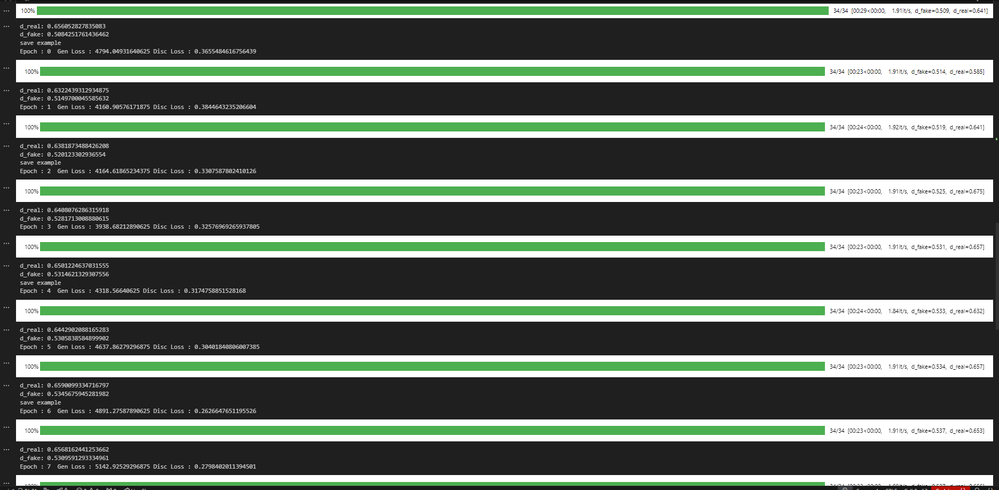

# Estructura del proyecto
- [pix2pix](pix2pix/): Se encuentran las declaraciones del Generador y del Discriminador 
- [checkpoints](checkpoints/): Se almacenan los estados de los diccionarios del Generador y Discriminador
- [database](database/): Donde se guarda la base de datos
- [DataSet](DataSet/): Se encuentra la declaración de Satelital2Map, donde se define el preprocesamiento de las datos de la base de datos para su posterior utilización
- [evaluation](evaluation/): Se encuentran los resultados de evaluar el modelo cada cierto tiempo contra el conjunto de validación
- [utils](utils/): Se encuentra la definición de funciones auxiliares
- `config.py`: Contiene configuraciones del proyecto como la cantidad de epochs a realizar, si se va a cargar un modelo preentrenado, etc...
- `database_download.py`: Contiene la lógica para descargar la base de datos desde la api de Google Earth Engine
- `training.ipynb` Se encuentra ubicada la lógica del entrenamiento del modelo

# Partes a describir
1. Descripción del modelo
    - Capas
    - Input y Output
1. Por qué una pix2pix GAN?
    - Uso
    - Diferencias con GAN stándar
1. Descripción de la base de datos
    - De dónde se obtuvo
    - Tipos de datos
1. Proceso realizado para llegar a nuestro modelo
    - Pruebas con otras funciones
    - Utilización de aumento de entrenamiento del Generador
1. Análisis de las fotos

## Epoch 1-10
